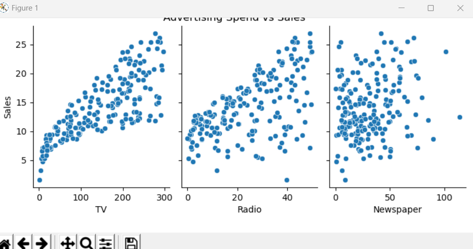
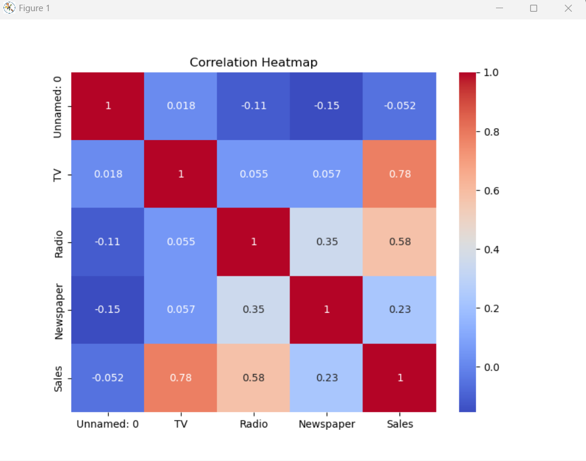

# CodeAlpha_Sales_Prediction

# Sales Prediction Using Python

## Project Overview

Sales prediction involves estimating how much of a product customers are likely to buy based on various influencing factors such as advertising budget, target audience segment, and advertising platforms.

In product and service-based businesses, data scientists use sales forecasting to optimize marketing spend and strategies. This project uses machine learning techniques with Python to predict future sales based on advertising data.

---

## Dataset

The dataset used in this project contains advertising spend on different platforms:

- **TV**: Advertising budget spent on TV
- **Radio**: Advertising budget spent on Radio
- **Newspaper**: Advertising budget spent on Newspaper
- **Sales**: The target variable representing product sales

Dataset source: [Advertising Dataset on Kaggle](https://www.kaggle.com/datasets/bumba5341/advertisingcsv)

---

## Project Structure

- `sales_prediction.py`: Python script containing the full implementation
- `Advertising.csv`: Dataset file (should be placed in the project folder)
- `README.md`: Project documentation

---

## Installation

Make sure you have Python installed. Then install the required libraries:

```bash
pip install pandas numpy matplotlib seaborn scikit-learn

```

## 📊 Output Plot


The following graph shows the relationship between advertising spend and sales:
### Sales plot


### corelation plot



## 👤 Author

**Velagapudi Mahendra**  
Data Scientist | Machine Learning Enthusiast

- GitHub: [Code-By-Mahendra](https://github.com/Code-By-Mahendra)  
- LinkedIn: [Velagapudi Mahendra](https://www.linkedin.com/in/velagapudi-mahendra-543481353)  
- Email:mahendravelagapudi099@gmail.com


